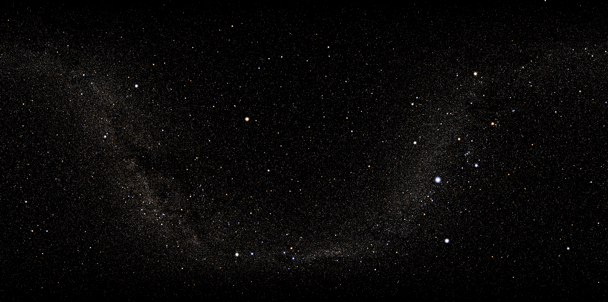
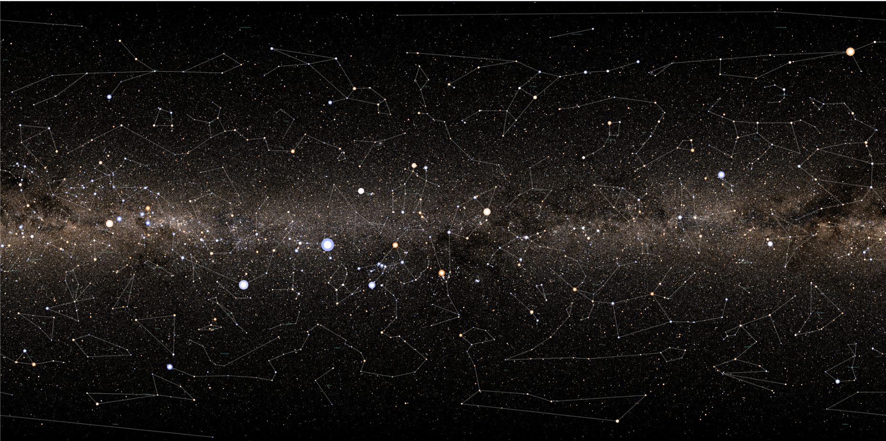

# Astral star map 2
Refactored version of its predecessor.

Planning to implement panaroma projections to fix previous issues.
Planning to add UI.
Added cordinate axis, config class, cordinate selection, etc.

## Required resources
Requires atleast the `render\static\data\binaries\all_stars` turtle binary file.
Is too big for my current github plan.
Provided on request.

## Sample
(Actual exports can have much higher quality, eg 32k)

High quality render + (RA DEC system)

Simple render + (galactic cordinate system)

At 32k quality:
Simple render ~10 min.
High qualtiy ~1 hour with single thread, ~20 min with multiprocessing. 
Note heavily subj to system specifications. 

