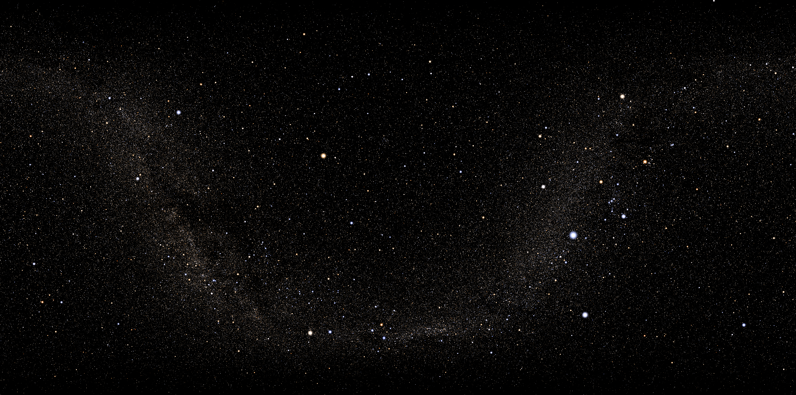
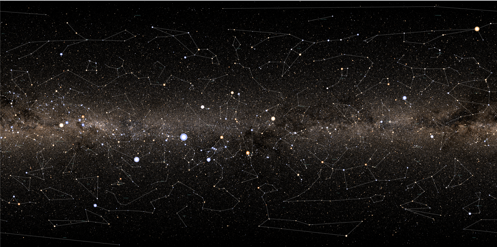

# Astral star map 2
Refactored version of its predecessor.

Renders around a million stars from the GAIA database through ecliptic or galactic cordinates, into a large high quality image.

Planning to implement panaroma projections to fix previous issues.
Planning to add UI.
Added cordinate axis, config class, cordinate selection, etc.

## Required resources
Requires atleast the `render\static\data\binaries\all_stars` turtle binary file.
Is too big for my current github plan, may be downloaded form google drive [here](https://drive.google.com/file/d/17sYW8ccLNKOs35wMnL6D3INtvtmAKITI/view?usp=sharing).

## Sample

mple image files (32k google drive)

High quality render + (RA DEC system)

Simple render + (galactic cordinate system)

At 32k quality:
Simple render ~10 min.
High qualtiy ~1 hour with single thread, ~10 min with multiprocessing. 
Note heavily subj to system specifications and config settings. 

Change config settings in `support/configsys.pt`.

